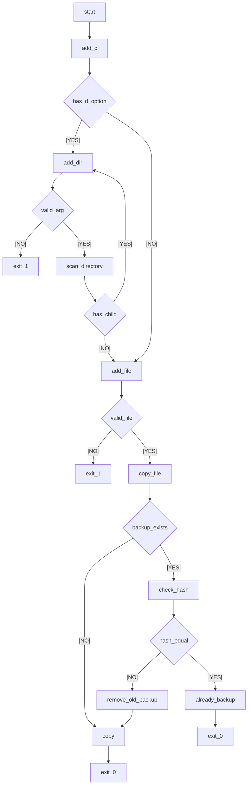
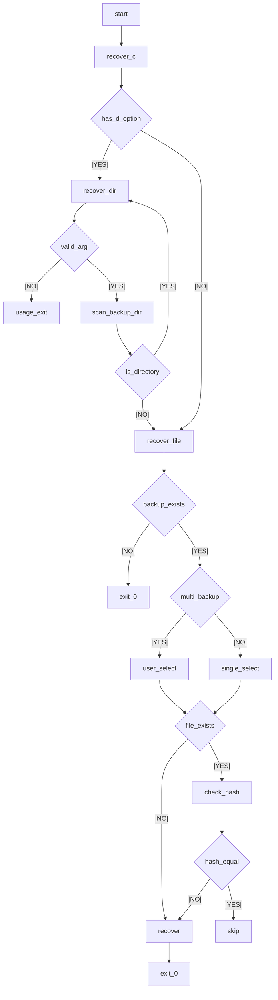

# backup (ssu_backup)

파일 또는 디렉토리를 **해시 기반 중복 제거(md5 / sha1)** 방식으로 백업하고,
필요 시 백업된 파일을 **원래 위치 또는 지정한 경로로 복구(recover)** 할 수 있는
리눅스 백업 프로그램입니다.

---

## 1. 폴더 구조

```text
backup/
├── start.c          # 메인 프롬프트 및 명령 분기
├── start.h
├── add.c            # 파일/디렉토리 백업 로직
├── recover.c        # 파일/디렉토리 복구 로직
├── help.c           # help 명령어
├── md5.c            # md5 해시 함수
├── sha1.c           # sha1 해시 함수
├── ssu_backup       # 실행 파일
├── Makefile
└── a.txt            # 테스트용 파일
```

* 백업 데이터는 **고정 디렉토리 `/home/backup`** 하위에 저장
* 실행 위치는 `$HOME` 하위 어느 경로에서도 가능
* 해시 값 비교를 통해 **중복 백업 방지**

---

## 2. 빌드 & 실행

### 빌드

```bash
make
```

### 실행

```bash
./ssu_backup <md5 | sha1>
```

* 실행 시 **해시 알고리즘(md5 또는 sha1)** 선택
* 선택된 해시 방식은 백업/복구 전 과정에 사용됨

프로그램 실행 후 내장 프롬프트가 출력되며,
`add`, `recover`, `help`, `exit` 등의 명령어 입력을 대기합니다.

```text
학번>
```


---

## 3. 내부 명령어 (Built-in Commands)

### `add <FILENAME> [OPTION]` : 파일 백업

```bash
add a.txt
```

* `<FILENAME>`은 **파일명 / 상대경로 / 절대경로** 모두 가능
* 백업 파일은 `/home/backup` 하위에 생성
* 파일명 뒤에 **백업 시각(_YYYYMMDDHHMMSS)** 을 붙여 저장

**동작 특징**

* 동일한 파일이 이미 백업되어 있고
* 해시 값이 동일한 경우 → **백업 생략**

---

### `add <DIRNAME> -d` : 디렉토리 백업

```bash
add testdir -d
```

* 디렉토리를 **재귀적으로 탐색**
* 하위 파일/디렉토리를 모두 백업
* 각 파일은 `add_file()` 로직을 통해 개별 백업 처리

**예외 처리**

* `-d` 옵션 없이 디렉토리 입력 시 에러
* 홈 디렉토리를 벗어난 경로 입력 시 에러
* 백업 디렉토리(`/home/backup`) 자체를 입력한 경우 에러


---

### `recover <FILENAME> [OPTION]` : 파일 복구

```bash
recover a.txt
```

* 백업 디렉토리(`/home/backup`)에서 파일 탐색 후 복구
* 동일한 이름의 백업 파일이 여러 개 존재하는 경우
  → **사용자에게 목록 출력 후 선택**

**복구 로직**

* 기존 파일이 존재하고 해시 값이 동일 → 복구 생략
* 기존 파일이 존재하지만 내용이 다름 → 덮어쓰기
* 기존 파일이 존재하지 않음 → 새 파일 생성 후 복구

---

### `recover <DIRNAME> -d` : 디렉토리 복구

```bash
recover testdir -d
```

* 디렉토리 하위 구조를 **재귀적으로 복구**
* 파일 단위로 해시 값을 비교하여

  * 동일한 파일은 복구 생략
  * 다른 파일만 복구 수행


---

### `help` : 도움말 출력

```bash
help
```

* 사용 가능한 명령어 및 옵션 출력


---

### `exit` : 프로그램 종료

```bash
exit
```

* 백업 프로그램 종료


---

## 4. 중복 백업 방지 방식

* 파일 백업 시 **md5 또는 sha1 해시 값 계산**
* 백업 디렉토리에 존재하는 동일 파일명(시간 정보 제외)과 비교
* 해시 값이 동일한 경우 → **백업하지 않음**

```text
<filename>_20240323030404
```

* 비교 시 `_날짜` 부분을 제거한 파일명 기준으로 판단

---

## 5. 동작 방식 요약

* 프로그램 시작 시

  * 해시 알고리즘 선택
  * 해시 값 공유를 위한 **공유 메모리 생성**
* `add`

  * 파일 / 디렉토리 여부 판단
  * 링크드 리스트로 백업 대상 관리
  * 해시 값 비교 후 백업 수행
* `recover`

  * 백업 디렉토리 탐색
  * 동일 파일 다중 존재 시 사용자 선택
  * 해시 비교 기반 안전 복구

### Flowchart (add/recover 처리 흐름)

<details> <summary>add(상세 흐름 펼치기)</summary>
  


</details>

<details> <summary>recover(상세 흐름 펼치기)</summary>
  


</details>

---

## 6. 참고 (개발 / 디버깅)

* 백업 디렉토리는 **`/home/backup`로 고정**
* 동일 파일을 여러 번 백업하더라도
  **내용이 동일하면 중복 저장되지 않음**
* 백업 파일명에 시간이 포함되어 있으므로
  복구 시 사용자 선택 로직 필요
* 디렉토리 복구(`-d`)는 **재귀 함수 기반 구현**

